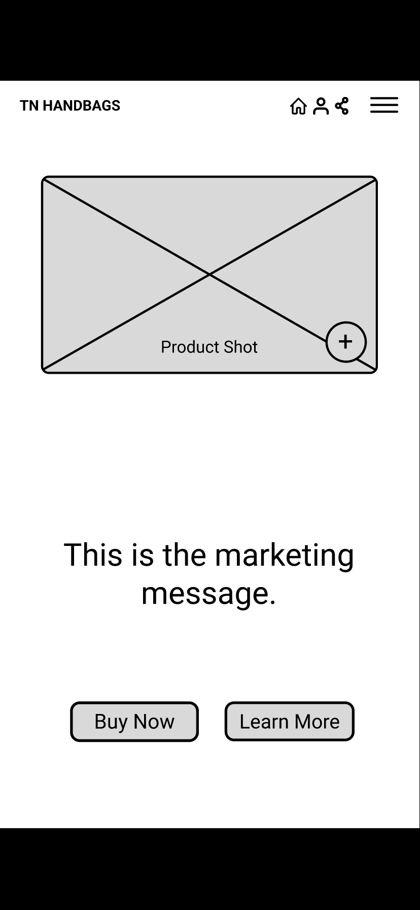

# UI/UX Design Using Figma

## Introduction

A personal project to learn the basic to advanced features of the Figma UI design tool, 
this repo is the main container to store in-class project assignments
and related files.

## Getting Start - Create Your Project

### Course Notes:
Introduction to Figma, UI/UX design concepts, and how to generate project 
UX/UI Brief.

**Assignment 01** - Create your brief about an ideal customer 

Based on a randomly generated project from [randomprojectgenerator](https://randomprojectgenerator.com), 
The assignment is to design the Mobile and Desktop apps for a Handbags e-commerce 
company.

**Solution - Example of an ideal customer**

## Wireframing - Low Fidelity

### Notes:

**Low Fidelity** - is the basic sketch either by pencil or by a software tool to 
express a brainstorming concept of what the app might look like and what component 
or interactive form needs to interact with the end-user. 

**High Fidelity** - is the full UI design with real graphics, typography, images,
layout, buttons... to demonstrate, and communicate to the client what the end 
product should look like.

## Type, Color & Icons
**Assignment 02** - Draw a simple wireframe 

**Solution**

**Assignment 03** - Add navbar icons to the wireframe.

**Solution**

## Prototyping Level 1

**Assignment 04** - Testing Prototype on iPhone 

**Solution** - iPhone wireframe test

Home Page

## Animation Level 1

**Assignment 05** - Create a simple animation 

**Solution** - An arrow flying from the left side to the middle of the screen

## Moodboard - High Fidelity

**Assignment 06** - Create a mood board

**Solution** - Some examples of handbags images

## Columns, Grid, and Colors

**Assignment 07** - Create columns layout for mobile and desktop, and select a color theme for the projects

**Solution** - mobile and desktop 12 columns layout, and main project colors

## Text & Fonts Advanced 

**Assignment 08** - Create a logo, and add a marketing message to the home page with selected fonts.

**Solution** - Mobile home page and fonts example

## Drawing 

**Assignment 09** - create icons and add them to the home page 

**Solution** - navbar icon, stars, hamburger, search, home, person, and buttons...

## Working with Photoshop

**Assignment 10** - edit some images in Photoshop and add them to the project's prototype

**Solution** - 

## Buttons

**Assignment 11** - Create responsive buttons that automatically resize when adding text, or text will increase its size when resizing the button.

**Solution**

## Autolayout & Constrints

**Assignment 12** - Create a responsive layout of the text box, review cards, and featured cards

**Solution**

